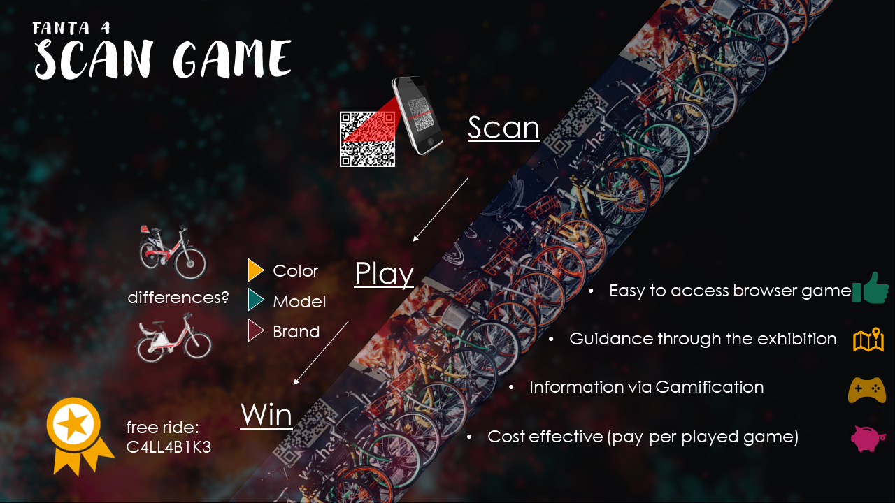

# Project SCAN GAME by FANTA4

## We take care of the exhibitions of TOMORROW

maybe small introduction -> Basti

## The problem
sort summery about the problem -> Linus

## The solution
sort summery about the solution -> Jamin

## Why SCAN GAME
short conclusion -> Tatjana (out of the presentation ...)

## Test SCAN GAME
 feel free to test [SCAN GAME](https://github.com/Real-Projects-Digitalization/FANTA4/wiki/3.1)-Prototype-Instructions) by your own.

## Documentation
[GitHub wiki](https://github.com/Real-Projects-Digitalization/FANTA4/wiki)

## Our GitHub page
[GitHub page](https://real-projects-digitalization.github.io/FANTA4/)

## This is our team:
<table>
  <tr>
    <th> Name </th>
    <th> Surname </th>
    <th> University </th>
    <th> City </th>
    <th> Cuntry </th>
  </tr>
  <tr>
    <td> Tatjana </td>
    <td> Ossig </td>
    <td >University of Applied Sciences </td>
    <td> Munich </td>
    <td> Germany </td>
  </tr>
  <tr>
    <td> Jamin </td>
    <td> Mok </td>
    <td> Pusan National University </td>
    <td> Pusan </td>
    <td> South Korea </td>
  </tr>
  <tr>
    <td>Linus </td>
    <td>Täreby </td>
    <td>Universty of Borås </td>
    <td>Borås </td>
    <td>Sweden </td>
  </tr>
  <tr>
    <td>Sebastian </td>
    <td>Feudel </td>
    <td>University of Applied Sciences </td>
    <td>Munich </td>
    <td>Germany </td>
  </tr>
</table>
